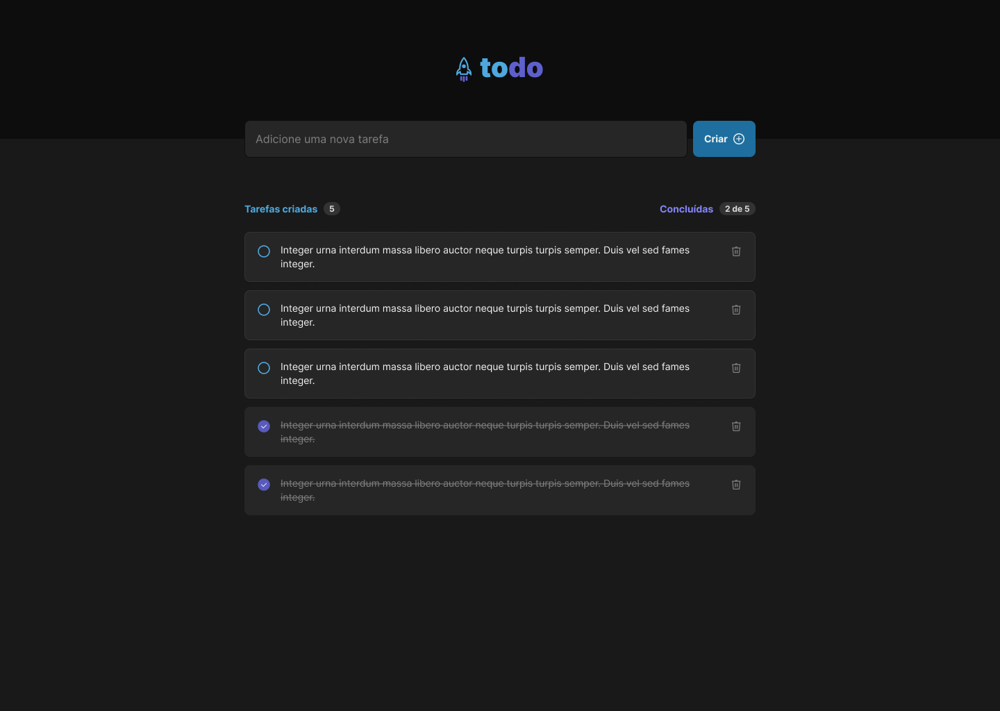

### Technologies Used
- **React**
- **TypeScript**
- **Vite**

### Installation
1. Clone the repository:
    ```sh
    git clone https://github.com/tiago0214/to-do-list
    ```
2. Navigate to the project directory:
    ```sh
    cd to-do-list
    ```
3. Install dependencies:
    ```sh
    npm install
    ```

### Usage
1. Start the development server:
    ```sh
    npm run dev
    ```
2. Open your browser and navigate to the provided URL (typically `http://localhost:5173`).